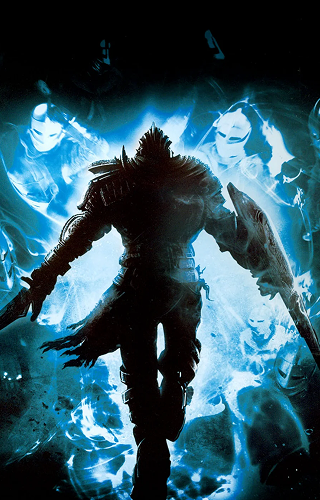

# Dark Souls Timeline

An interactive visualization of the Dark Souls series timeline, exploring the deep lore from the Age of Ancients through the cycle of Fire and Dark.



## About

This project presents a chronological journey through the most significant events in the Dark Souls universe. Each timeline entry features:

- Historical event descriptions
- Original Japanese keywords and terminology
- Dynamic background imagery
- Atmospheric visual transitions

## Features

- 📜 Interactive timeline navigation
- 🎭 Misty reveal effects on hover
- 🈯 Bilingual content (English/Japanese)
- 📱 Responsive design
- 🎮 Game-authentic visuals

## Tech Stack

- React
- TypeScript
- Tailwind CSS
- Vite

## Live Demo

Visit the timeline at: TBA

## Project Structure

```
dark-souls-timeline/
├── src/
│   ├── assets/         # Game images and logos
│   ├── components/     # Reusable UI components
│   ├── pages/         # Main page components
│   └── main.tsx       # Application entry point
```

## Contributing

Found a lore inaccuracy or want to add more content? Feel free to:
1. Fork the repository
2. Create your feature branch
3. Submit a pull request

## Credits

- All Dark Souls content and imagery belongs to FromSoftware/Bandai Namco
- Developed with respect for the original source material

## License

This project is licensed under the MIT License.

---

*"Touch the darkness within me..."* 🔥